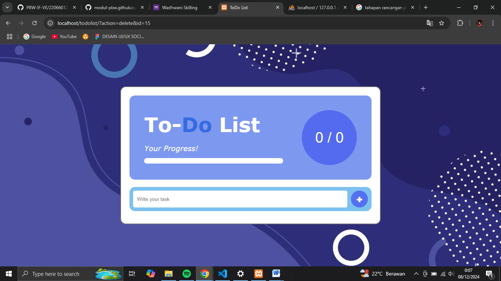
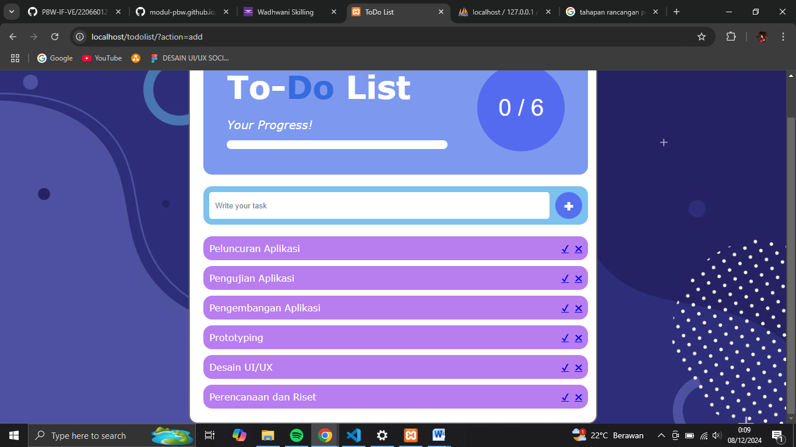
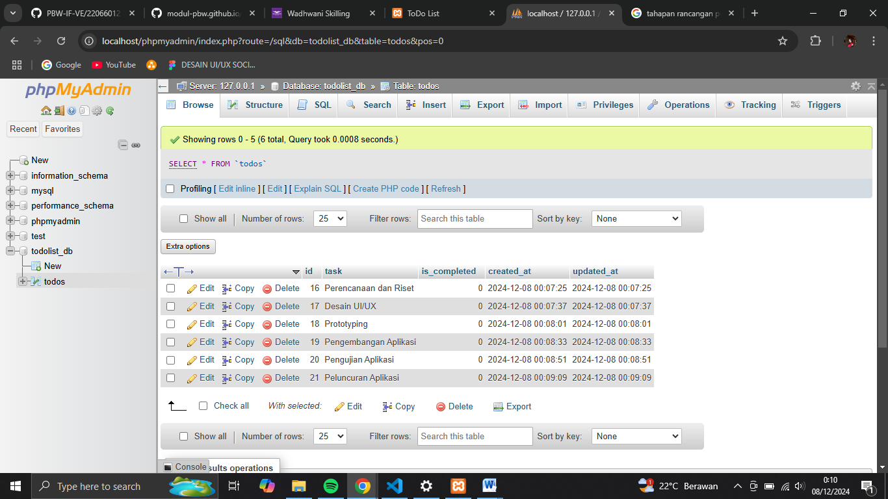
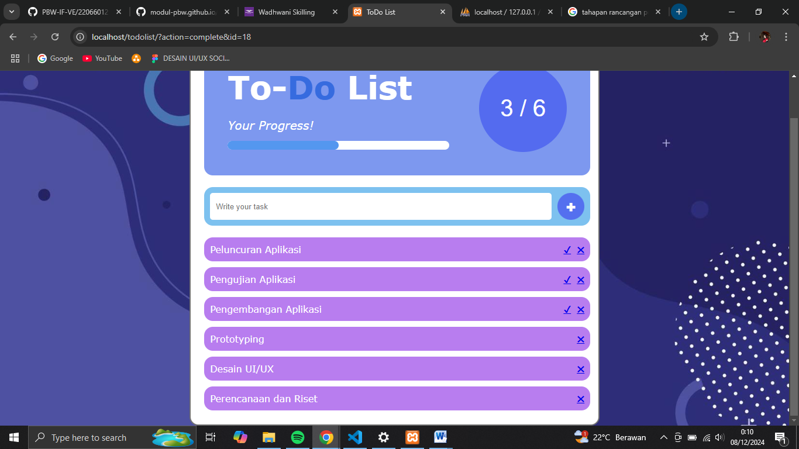
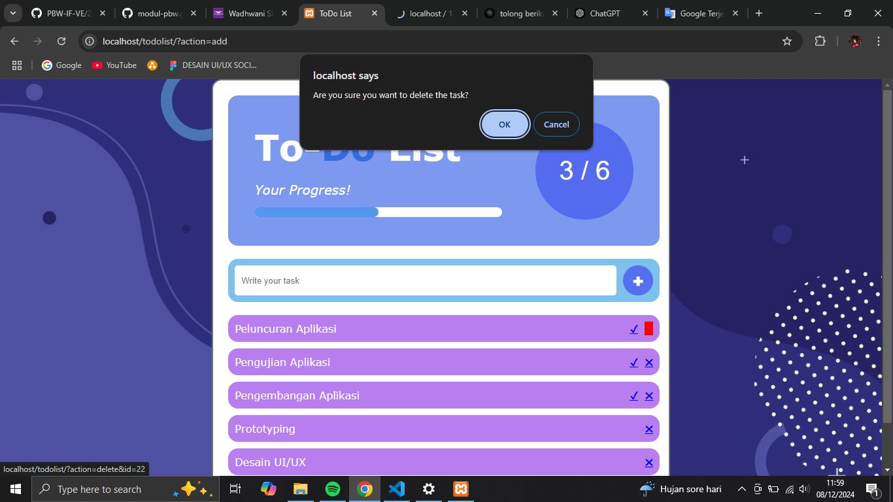
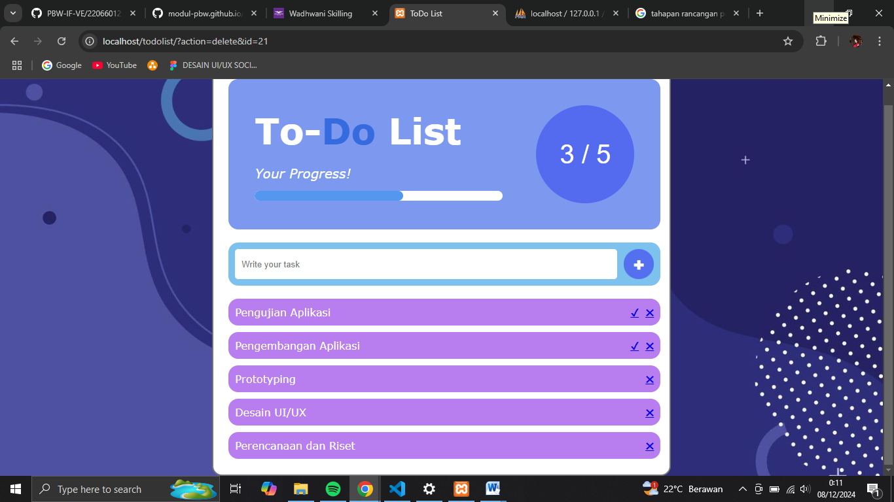
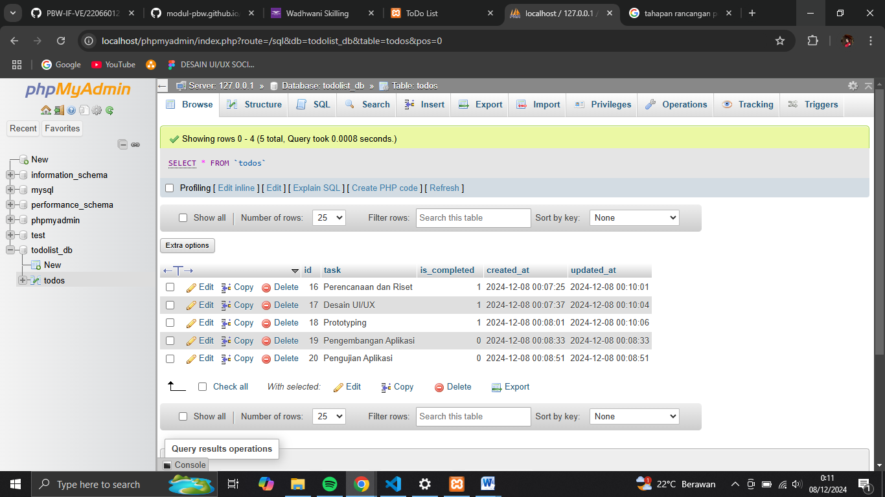

# ToDo List Project

## 📋 Overview
Proyek ToDo List adalah aplikasi berbasis web yang dirancang untuk membantu pengguna mengelola tugas sehari-hari mereka dengan lebih efisien. Dengan antarmuka yang sederhana dan intuitif, pengguna dapat dengan mudah menambahkan, mengedit, dan menghapus tugas, serta menandai tugas yang telah selesai. Aplikasi ini bertujuan untuk meningkatkan produktivitas dan membantu pengguna tetap terorganisir.

ToDo List ini mendukung operasi CRUD (Create, Read, Update, Delete), yang memungkinkan untuk mencatat tugas baru, menandai tugas yang telah selesai, serta menghapus tugas yang tidak lagi relevan. Seluruh data tugas disimpan di dalam database, sehingga data tidak akan hilang dan dapat diakses kembali meskipun dimuat ulang atau digunakan di lain waktu.

## ✨ Features
1. **Menambahkan Tugas Baru :** Pengguna dapat dengan mudah menambahkan tugas baru ke dalam daftar.
2. **Menandai Tugas :** Tugas dapat ditandai sebagai selesai atau belum selesai, memberikan visualisasi yang jelas tentang kemajuan.
3. **Penghapusan Tugas Selesai :** Pengguna dapat menghapus tugas yang telah selesai, menjaga daftar tetap bersih dan terorganisir.
4. **Penyimpanan Data :** Data tugas disimpan secara lokal, sehingga pengguna dapat mengaksesnya kapan saja dan di mana saja.

## 🎯 Goals 
Tujuan dari proyek ini adalah untuk memberikan solusi sederhana namun efektif bagi individu yang ingin mengelola tugas mereka dengan lebih baik, pengguna dapat:

- Meningkatkan produktivitas dengan mengorganisir tugas-tugas mereka.
- Mengurangi stres dengan memiliki daftar tugas yang jelas dan terstruktur.
- Mencapai tujuan pribadi dan profesional dengan lebih efisien.

## 📂 File Structure
```graphql
/todolist_project
├── index.php                    # Entry point aplikasi
├── config
│   └── Database.php             # Koneksi database menggunakan PDO
├── models
│   ├── Todo.php                 # Model Todo yang merepresentasikan setiap task
│   └── TodoModel.php            # Model untuk operasi CRUD pada database
├── controllers
│   └── TodoController.php       # Controller untuk mengatur logika bisnis Todo
├── views
│   └── listTodos.php            # Template/view untuk menampilkan daftar Todo
└── assets
    ├── style.css                # File CSS untuk styling
    ├── script.js                # File JavaScript untuk interaksi tambahan
    └── background.jpg           # File Jpg untuk menambahkan desain background
```

## 📌 How It Work
1. Menambahkan taks pada formulir yang ada dengan menekan tombol ikon tambah `(➕)` atau menekan `Enter` pada Keyboard anda, sehingga data tugas dikirim ke server menggunakan metode `POST` dengan parameter `action=add`. Controller `(TodoController.php)` kemudian akan memproses data tersebut dan menyimpannya ke dalam tabel todos di database menggunakan fungsi yang ada pada `TodoModel.php`.

2. Setelah data tersimpan, daftar tugas muncul di halaman. Data tugas diambil dari tabel todos di database menggunakan fungsi `getAllTodos()` dari `TodoModel.php`, kemudian ditampilkan secara iteratif menggunakan `loop foreach`. Setiap tugas memiliki dua tombol aksi: complete atau ikon centang `(✔️)` untuk menandai tugas selesai, dan delete atau ikon silang `(❌)` untuk menghapus tugas.

3. Saat anda menekan tombol complete atau ikon centang `(✔️)`, parameter `action=complete&id={id_tugas}` akan dikirim ke server. `Controller (TodoController.php)` kemudian akan memanggil fungsi pada `TodoModel.php` untuk memperbarui status tugas `(is_completed)` di database menjadi selesai `(1)`. Tugas yang selesai akan ditampilkan dengan hilangnya ikon centang `(✔️)`.

Saat anda menekan tombol delete atau ikon silang `(❌)`, modal konfirmasi akan muncul untuk mencegah penghapusan yang tidak disengaja. Jika dikonfirmasi, parameter `action=delete&id={id_tugas}` akan dikirim ke server. `Controller (TodoController.php)` kemudian akan memanggil fungsi di `TodoModel.php` untuk menghapus tugas dari database. Setelah tugas berhasil dihapus, tampilan daftar tugas akan diperbarui otomatis, dan tugas yang telah dihapus tidak lagi ditampilkan pada halaman.

Statistik tugas akan dihitung berdasarkan jumlah total tugas menggunakan `const totalTasks = taskList.children`.`length;` dan jumlah tugas yang telah diselesaikan menggunakan `const completedTasks = document.querySelectorAll("#taskList .task.completed")`.`length;`. Dengan data tersebut, persentase penyelesaian dapat dihitung menggunakan `const progressPercentage = totalTasks ? (completedTasks / totalTasks) * 100 : 0;`. Proses ini memastikan statistik tugas diperbarui secara dinamis setiap kali tugas ditambahkan, dihapus, atau ditandai selesai.

## Screenshots
### 1. Tampilan Awal
Tampilan awal pada ToDo List di mana belum ada tugas yang ditambahkan, statistik tugas menunjukkan `0/0`, progress bar kosong, dan daftar tugas tidak menampilkan item apa pun.



### 2. Tampilan Menambahkan Tugas
Setiap tugas memiliki opsi untuk ditandai sebagai selesai `(✔️)` atau dihapus `(❌)`.



### 3. Tampilan Database 
Data tugas yang dimasukkan akan disimpan dalam tabel database bernama `todos`. Tabel ini terdiri dari beberapa kolom dengan fungsi sebagai berikut:
- **`id`:** Kolom *primary key* yang berisi ID unik untuk setiap tugas. ID ini diatur secara otomatis menggunakan *auto-increment*.
- **`task`:** Kolom yang menyimpan nama tugas yang dimasukkan.
- **`is_completed`:** Kolom yang menyimpan status tugas, di mana nilai `1` menunjukkan bahwa tugas telah selesai, sedangkan nilai `0` menunjukkan bahwa tugas belum selesai.
- **`created_at`:** Kolom *timestamp* yang menyimpan waktu kapan tugas dibuat.
- **`updated_at`:** Kolom *timestamp* yang menyimpan waktu kapan data tugas terakhir kali diperbarui.



### 4. Tampilan Bar Daftar Tugas Setelah Selesai
Ketika sebuah tugas ditandai sebagai selesai `(✔️)`, maka tampilan pada tugas tersebut tidak ada ikon Selesai `(✔️)` lagi. Dan untuk tampilan statistik tugas akan diperbarui secara dinamis berdasarkan status tugas. Jumlah tugas yang telah selesai akan tercatat, dan persentase penyelesaian ditampilkan melalui indikator progress bar.



### 5. Tampilan Database Setelah Selesai
Pada kolom **`is_completed`:** akan menyimpan status tugas, di mana nilai `1` menunjukkan bahwa tugas telah selesai, sedangkan nilai `0` menunjukkan bahwa tugas belum selesai.


### 6. Tampilan Bar Penghapusan Tugas
Ketika sebuah tugas akan dihapus `(❌)`,maka akan terdapat notifikasi untuk melanjutkan penghapus tugas atau tidak untuk mencegah terjadinya tidak sengaja terhapus karena menekan tombol `(❌)`, setelah kita kofirmasi untuk menghapus maka tampilan pada tugas akan hilang. Dan Persentase penyelesaian tugas pada jumlahnya akan berkurang.





### 7. Tampilan Database Setelah Penghapusan
Ketika anda telah menghapus tugas pada formulir maka secara otomatis pada Database MySQL pun akan hilang.

